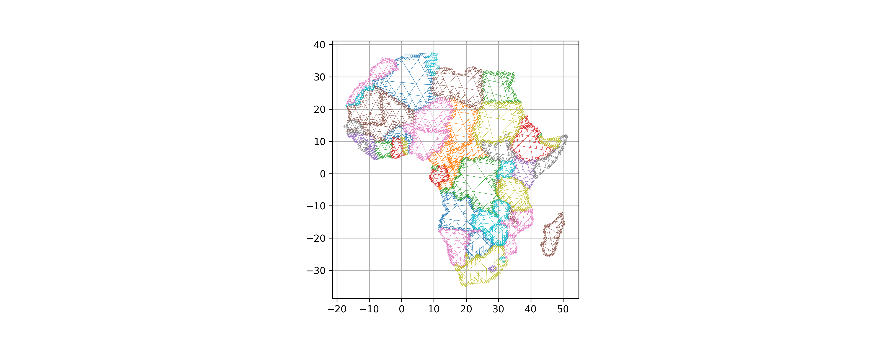
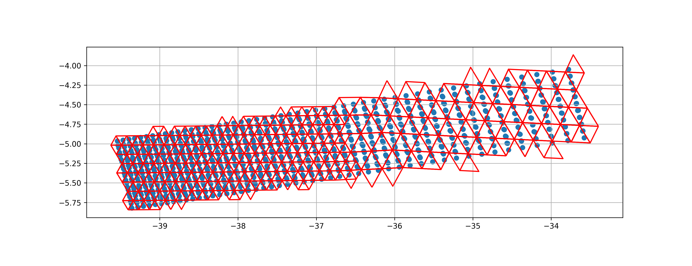

# STAREPandas
STAREpandas adds [SpatioTemporal Adaptive Resolution Encoding
(STARE)](https://github.com/SpatioTemporal) support to [pandas DataFrames](https://pandas.pydata.org/).


## Introduction
STAREPandas is the STARE pendant to [GeoPandas](https://geopandas.org/). 
It makes working with geospatial data in python easier. 
It provides file and database I/O functionality and allows to easily perform STARE based 
spatial operations that would otherwise require a (STARE-extended) spatial database or a geographic information system. 

In STAREDataFrames, geometries are represented as sets of STARE triangles or ”trixels”; 
analogously to GeoPandas geodataframes which represent geometries as WKT. In STARE dataframes, 
points are represented as STARE trixels at the HTM tree’s leaf level. 
Polygons are represented as sets of STARE trixels that cover the polygon. 

STAREPandas also extends the geopandas file I/O functionality to load some (raster) formats of 
remote sensing granules and tiles (MOD09, MOD09GA, VNP03) through pyhdf and netcdf4.


## Installation on Linux

### pyhdf
STAREPandas depends on pyhdf to read hdf4-eos granules, requiring libhdf4-dev, to build.

Tested on python 3.7.6

On Ubuntu 20.04:

```shell
apt install libhdf4-dev 
```

On Centos7:

```shell
yum install hdf-devel.x86_64

```

Alternatively, pyhdf can also be found on conda

```shell
conda install -c conda-forge pyhdf
```
### pystare
STAREPandas is built on top of [pystare](https://github.com/SpatioTemporal/pystare).

```shell
pip3 install pystare
```

### STAREPandas
It is recommendable to install pip packages in a [Virtual Environment](https://pip.pypa.io/warnings/venv)

```
mkvirtualevironment starepandas
```

Make sure pip is up-to-date.

Then install STAREPandas from github.

```shell
pip3 install starepandas
```

    
## Installation on MacOS M1

#### I.Install STARE on MacOS M1
1. Create new conda env with python 3.12:

`conda create -n <YOUR_CONDA_ENV> python=3.12`

E.g: `conda create -n stare_3.12 python=3.12`

2. Activate conda env:

`conda activate <YOUR_CONDA_ENV>`

E.g: `conda activate stare_3.12`
3. Install numpy:

`conda install -c conda-forge numpy`

4. Install cmake:

```
sudo apt update  
sudo apt install cmake
```

or:

`conda install -c conda-forge cmake`

5. Install doxygen & x-code-select:

```
conda install -c conda-forge doxygen
xcode-select --install
```

6. (Optional) May need to link librhash library
```
cd /Users/tonhai/miniconda3/envs/<YOUR_CONDA_ENV>/lib
ln -s librhash.<VERSION>.dylib librhash.0.dylib
```
E.g:
```
cd /Users/tonhai/miniconda3/envs/stare_3.12/lib
ln -s librhash.1.4.5.dylib librhash.0.dylib
```

7. Download & install STARE from source:

```
git clone https://github.com/SpatioTemporal/STARE  
cd STARE
mkdir build
cd build
cmake -DCMAKE_OSX_ARCHITECTURES=arm64 \
      -DCMAKE_OSX_SYSROOT="$(xcode-select --print-path)/SDKs/MacOSX.sdk" \
      -DCMAKE_OSX_DEPLOYMENT_TARGET=11.0 \
      -DCMAKE_CXX_FLAGS="-isysroot $(xcode-select --print-path)/SDKs/MacOSX.sdk -I$(xcode-select --print-path)/SDKs/MacOSX.sdk/usr/include/c++/v1" \
      -DSTARE_INSTALL_LIBDIR=lib \
      -DBUILD_SHARED_LIBS=NO \
      ../
make -j4
sudo make install
```

8. Check to see if libSTARE.a in /usr/local/lib/ and STARE.h in /usr/local/include/, if not:
```
export STARE_INCLUDE_DIR=/path/to/directory-containing-stare.h/  
export STARE_LIB_DIR=/path/to/directory-containing-stare.a/
```

E.g.:
```
export STARE_INCLUD_DIR=/Users/tonhai/miniconda3/envs/stare_3.12/include/STARE
export STARE_LIB_DIR=/Users/tonhai/miniconda3/envs/stare_3.12/lib
```

```
python3 setup.py build_ext --inplace 
python3 setup.py bdist_wheel
python3 setup.py sdist
```

#### II. Install pystare on MacOS M1
1. Install setuptools, swig and wheel:

`conda install -c conda-forge setuptools swig wheel`

2. Install xcode-select:

`xcode-select --install`

3. Download pystare, rebuild and install:
```
git clone https://github.com/SpatioTemporal/pystare  
cd pystare  
export CXXFLAGS="-I$(xcode-select --print-path)/SDKs/MacOSX.sdk/usr/include/c++/v1"
python3 setup.py build_ext --inplace  
python3 setup.py bdist_wheel  
python3 setup.py sdist  
pip3 install .  
```

If there is any issue, try to export this and retry:

`export CXXFLAGS="-I/Library/Developer/CommandLineTools/SDKs/MacOSX.sdk/usr/include/c++/v1"`

#### III. Install STAREpandas on MacOS M1
1. Install setuptools, swig and wheel: 

`conda install -c conda-forge setuptools swig wheel`

2. Install xcode-select:

`xcode-select --install`

3. Export CXXFLAGS

`export CXXFLAGS="-I$(xcode-select --print-path)/SDKs/MacOSX.sdk/usr/include/c++/v1"`
Or: 
`export CXXFLAGS="-I/Library/Developer/CommandLineTools/SDKs/MacOSX.sdk/usr/include/c++/v1"`

4. Download STAREPandas, rebuild and install: 

```
git clone https://github.com/SpatioTemporal/STAREPandas  
cd STAREPandas  
python3 setup.py build_ext --inplace  
python3 setup.py bdist_wheel  
python3 setup.py sdist  
pip3 install . 
``` 

## Note
Some of the examples require Rtree-linux to be installed to run geopandas spatial joins. 
As of 2020-08-20, I could not make this work on Centos7 with rtree>0.9 (9.4) as it requires GLIBCXX_3.4.21. I therefor downgrade rtree to rtree-0.8.3 on Centos7 

```shell
pip3 install "rtree>=0.8,<0.9
```
    
This is likely related to [rtree issue 120](https://github.com/Toblerity/rtree/issues/120)


## Tests
```shell
cd starepandas/
pytests
```

Some of the examples further require bokeh and pandas_bokeh


## Documentation
starepandas uses sphinx

The dependencies are in ```docs/source/requirements.txt```

```
pip3 install -r docs/source/requirements.txt
```

Build the docs with e.g.
```
cd docs/
make html 
```
    
    
## Features and usage
The examples/ folder contains notebooks that highlight the usage.

STAREPandas helps integrating STARE in the geospatial data workflow.
Building on top of fiona and geopandas, STAREPandas allows to read almost any vector-based spatial data format and convert lat/lon and well-known-text (WKT) representation to STARE indices and covers.

```python
path = geopandas.datasets.get_path('naturalearth_lowres')
world = geopandas.read_file(path)
africa = world[world.continent == 'Africa']
stare = starepandas.sids_from_gdf(africa, level=7, force_ccw=True)
africa = starepandas.STAREDataFrame(africa, stare=stare)
```
    
STAREPandas extends the geopandas rich plotting abilities and provides a simple method to generate visualizations of trixels:

```python
trixels = africa.make_trixels()
africa.set_trixels(trixels, inplace=True)
africa.plot(ax=ax, trixels=True, boundary=True, column='name', linewidth=0.2)
```
    


STAREPandas extends the file I/O capability with the ability to read common remote-sensing granule data from HDF and netCDF files. STARE indices for the granules can either be generated on demand or read from a companion / sidedcar file.
    
```python
path= 'data/MYD05_L2.A2020060.1635.061.2020061153519.hdf'
modis = starepandas.read_mod09(path, add_stare=True, adapt_resolution=True)
```



STAREPandas allows to carry out STARE-based spatial relation tests and spatial joins.

```python
cities = ['Buenos Aires', 'Brasilia', 'Santiago',
          'Bogota', 'Caracas', 'Sao Paulo', 'Bridgetown']
latitudes = [-34.58, -15.78, -33.45, 4.60, 10.48, -23.55, 13.1]
longitudes = [-58.66, -47.91, -70.66, -74.08, -66.86, -46.63, -59.62]
data = {'City': cities,
        'Latitude': latitudes, 'Longitude': longitudes}
cities = starepandas.STAREDataFrame(data)
stare = starepandas.sids_from_xy(cities.Longitude, cities.Latitude, level=27)
cities.set_sids(stare, inplace=True)

countries = geopandas.read_file(geopandas.datasets.get_path('naturalearth_lowres'))
countries = countries.sort_values(by='name')
samerica = countries[countries.continent == 'South America']
stare = starepandas.sids_from_gdf(samerica, level=10, force_ccw=True)
samerica = starepandas.STAREDataFrame(samerica, stare=stare)

starepandas.stare_join(samerica, cities, how='left').head()
```


STAREPandas further allows for STARE-bases intersections:

```python
fname = 'zip://data/amapoly_ivb.zip'
amazon = geopandas.read_file(fname)  # Nice flex
amazon = amazon.to_crs('EPSG:4326')

stare = starepandas.sids_from_gdf(amazon, level=10, force_ccw=True)
amazon = starepandas.STAREDataFrame(amazon, stare=stare)

stare_amazon = samerica.stare_intersection(amazon.make_sids.iloc[0])
```
    
    


# Troubleshooting
## `UserWarning: pyproj unable to set database path _pyproj_global_context_initialize()` Or `Invalid projection: EPSG:4326: (Internal Proj Error: proj_create: no database context specified)`

This is typically caused by a problem with the PROJ library and Geopandas. So, one potential solution for this is to do the followings:

- Install proj-data with conda: `conda install -c conda-forge proj-data`
- Install geopandas and pyproj with pip:
    - may need to uninstall geopandas from conda: `conda remove geopandas`
    - `pip install scipy`
    - `pip install pyproj geopandas`
    - May need to install shapely with conda: `conda install -c conda-forge shapely`
    - May need to intall matlib: `conda install -c conda-forge matplotlib`
    - Check the PROJ data directory: 
    - `import python`
    - `print(pyproj.datadir.get_data_dir())`
    - `export PROJ_LIB=/path/to/proj/data`

# Acknowledgments
2018-2021 STARE development supported by NASA/ACCESS-17 grant 80NSSC18M0118.


